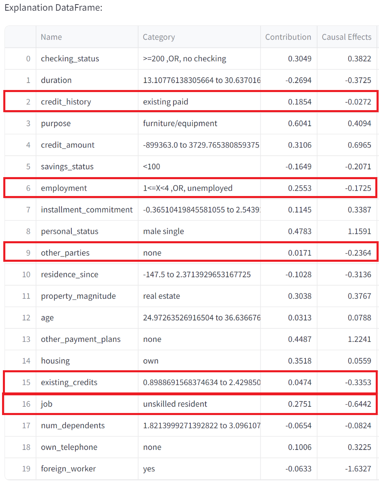

# LEURN
Official Repository for LEURN: Learning Explainable Univariate Rules with Neural Networks
https://arxiv.org/abs/2303.14937

Detailed information about LEURN is given in the presentations.
A demo is provided for training, making local explanations and data generation in DEMO.py

NEW! Streamlit demo is now available
Just activate the environment and run the following in your command line.
streamlit run UI.py
Make sure you check the explanation video at:
https://www.linkedin.com/posts/caglaraytekin_ai-machinelearning-dataanalysis-activity-7172866316691869697-5-nB?utm_source=share&utm_medium=member_desktop

NEW! LEURN now includes Causal Effects
Thanks to its unique design, LEURN can make controlled experiments at lightning speed, discovering average causal effects.

Main difference of this implementation from the paper:
- LEURN is now much simpler and uses binarized tanh (k=1 always) with no degradation in performance.

Notes: 
- For top performance, a thorough hyperparameter search as described in paper is needed.
- Human-in-the-loop continuous training is not implemented in this repository.
- Deepcause provides consultancy services to make the most out of LEURN

Contact:
caglar@deepcause.ai
